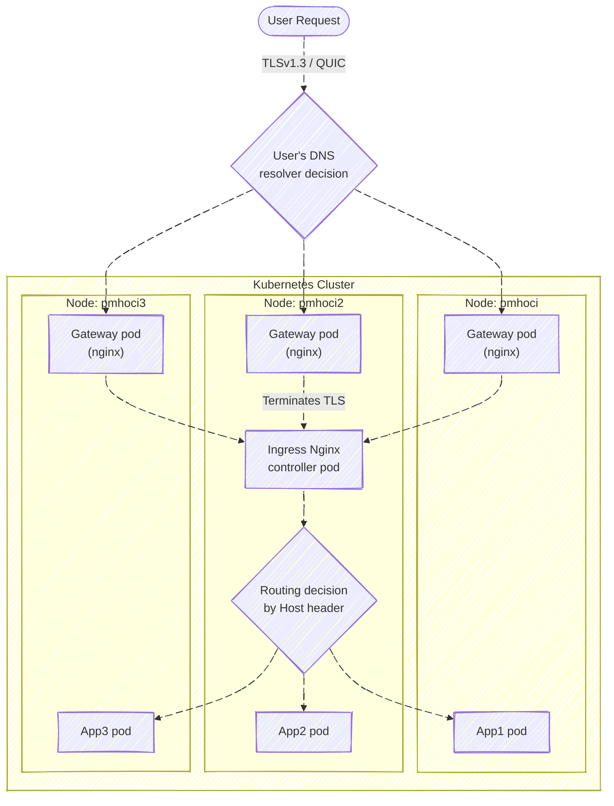

# pmh-only/lab
Kubernetes Manifest Files for [My Homelab Server](https://pmh.codes)

 
 

## How it works?
[An ArgoCD instance](https://argo.pmh.codes/) continuously monitors the [./apps](https://github.com/pmh-only/lab/tree/main/apps) folder, which contains manifest files [referencing each application's manifest directory](https://argo.pmh.codes/applications/argocd/apps).\
These manifests trigger full resource synchronization when updates occur.

Meanwhile, the ArgoCD Image Updater ensures that container images are always kept at their latest versions.

## Traffic routes

