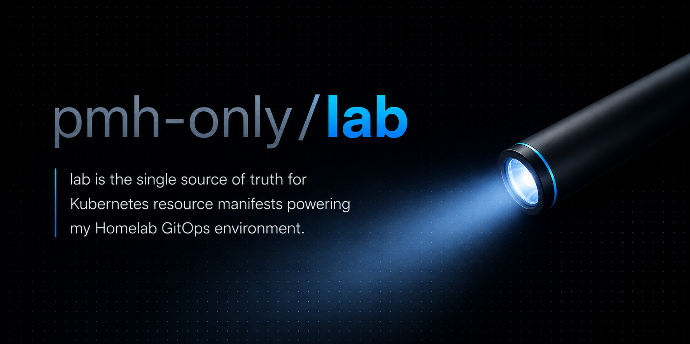

# pmh-only/lab

**lab** is the Single source of truth repository contains Kubernetes resource manifest files for my Homelab GitOps environment powered by ArgoCD.

Covered domains include, but are not limited to, apex and subdomains of https://pmh.codes and https://pmh.so.

An ArgoCD instance continuously monitors the apps folder, which contains manifest files that reference each application's manifest directory. When updates occur, these manifests trigger full resource synchronization. More information of this structure is [here: [App of Apps]](https://argo-cd.readthedocs.io/en/stable/operator-manual/cluster-bootstrapping/#app-of-apps-pattern-alternative)

At the same time, the ArgoCD Image Updater ensures that container images always stay up to date with the latest versions.

## Contents
This repository defines many components of Kubernetes cluster such as:
* Public Domain Name Server / Private Resolver (Technitium DNS Server)
* HTTP Routings/Rewrites (Customed DaemonSet Gateway, Envoy Gateway)
* TLS Certificate Management/Ordering (cert-manager)
* Static Website Serving (RustFS)
* SQL/No-SQL Databases (MySQL, PostgreSQL, MongoDB, Redis)
* Observabilities (Grafana, Prometheus, Thanos)
* Public Gateway / Internal Connector of my Tailscale Network
* Encrypted Secrets (SealedSecret)
* Volumn and Cluster Backup Schedule (Velero, Kopia)
* and Actual Service Components.

## Sync Status
<!-- SYNC_TABLE_START -->

<table>
  
  <tr>
  <td> </td>
  
  
  
  <td> </td>
  
  
  
  <td> </td>
  
  
  
  <td> </td>
  </tr>
  
  <tr>
  <td> </td>
  
  
  
  <td> </td>
  
  
  
  <td> </td>
  
  
  
  <td> </td>
  </tr>
  
  <tr>
  <td> </td>
  
  
  
  <td> </td>
  
  
  
  <td> </td>
  
  
  
  <td> </td>
  </tr>
  
  <tr>
  <td> </td>
  
  
  
  <td> </td>
  
  
  
  <td> </td>
  
  
  
  <td> </td>
  </tr>
  
  <tr>
  <td> </td>
  
  
  
  <td> </td>
  
  
  
  <td> </td>
  
  
  
  <td> </td>
  </tr>
  
  <tr>
  <td> </td>
  
  
  
  <td> </td>
  
  
  
  <td> </td>
  
  
  
  <td> </td>
  </tr>
  
  <tr>
  <td> </td>
  
  
  
  <td> </td>
  
  
  
  <td> </td>
  
  
  
  <td> </td>
  </tr>
  
  <tr>
  <td> </td>
  
  
  
  <td> </td>
  
  
  
  <td> </td>
  
  
  
  <td> </td>
  </tr>
  
  <tr>
  <td> </td>
  
  
  
  <td> </td>
  
  
  
  <td> </td>
  
  
  
  <td> </td>
  </tr>
  
  <tr>
  <td> </td>
  
  
  
  <td> </td>
  
  
  
  <td> </td>
  
  
  
  <td> </td>
  </tr>
  
  <tr>
  <td> </td>
  
  
  
  <td> </td>
  
  
  
  <td> </td>
  
  
  
  <td> </td>
  </tr>
  
  <tr>
  <td> </td>
  
  
  
  <td> </td>
  
  
  
  <td> </td>
  
  
  
  <td> </td>
  </tr>
  
  <tr>
  <td> </td>
  
  
  
  <td> </td>
  
  
  
  <td> </td>
  
  
  
  <td> </td>
  </tr>
  
  <tr>
  <td> </td>
  
  
  
  <td> </td>
  
  
  
  <td> </td>
  
  
  
  <td> </td>
  </tr>
  
</table>

<!-- SYNC_TABLE_END -->
    
    

## Acknowledges
&copy; 2024-2026. Minhyeok Park <pmh_only@pmh.codes>. MIT Licensed.

This repository contains some of contents from previous repository: [pmh-only/composes](https://github.com/pmh-only/composes).
