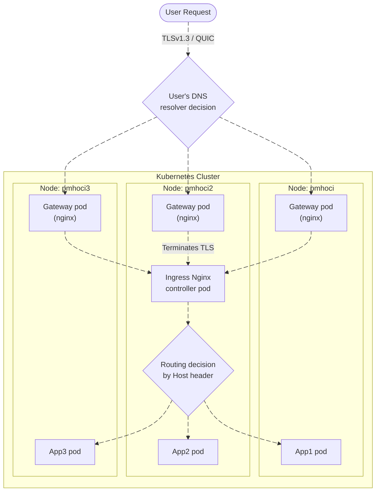

# pmh-only/lab
Kubernetes Manifest Files for [My Homelab Server](https://pmh.codes)

 
 

## How it works?
An [ArgoCD instance](https://argo.pmh.codes/) continuously monitors the [apps folder](https://github.com/pmh-only/lab/tree/main/apps), which contains manifest files that [reference each application's manifest directory](https://argo.pmh.codes/applications/argocd/apps).
When updates occur, these manifests trigger full resource synchronization.

At the same time, the ArgoCD Image Updater ensures that container images always stay up to date with the latest versions.

## Traffic routes

